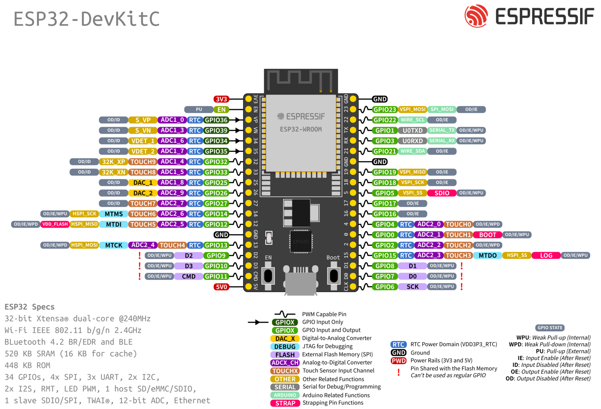

# DAY 2

## The reference hardware: ESP32-WROOM-32



## Let's start by simulating it

[Wokwi](https://docs.wokwi.com/) is an online Electronics simulator. You can use it to simulate Arduino, ESP32, STM32, and many other popular boards, parts and sensors.

* The simplest actuator, namely a [led](https://wokwi.com/projects/367336864678247425)
* The Simplest sensor, namely a [button](https://wokwi.com/projects/367336996835545089)
* A bit more interesting sensor, namely a [potentiometer](https://wokwi.com/projects/367338868313181185)
* A simple example with [SR04 Ultrasonic Sensor](https://wokwi.com/projects/367320442567677953)
* It's time to be connected by [MQTT](https://wokwi.com/projects/367405831605855233)

```
mosquitto_pub -h test.mosquitto.org -t "topicName/led" -m "on"
mosquitto_pub -h test.mosquitto.org -t "topicName/led" -m "off"
```

**NOTE:** for the sake of convenience, we will use WiFi connectivity, however it should be now clear WiFi is usually not appropriate for IoT applications due to the excessive energy demand. 

## It is time to Work with a real device

* Download the code from Wokwi. It is also available on [https://github.com/andreavitaletti/IoT_short_course/tree/main/src/simulator](https://github.com/andreavitaletti/IoT_short_course/tree/main/src/simulator)
* The easiest way it to use the [Arduino IDE](https://support.arduino.cc/hc/en-us/articles/360019833020-Download-and-install-Arduino-IDE) 